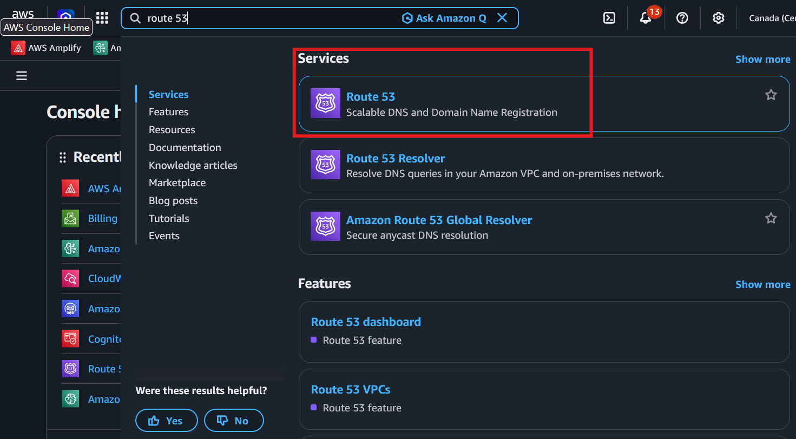
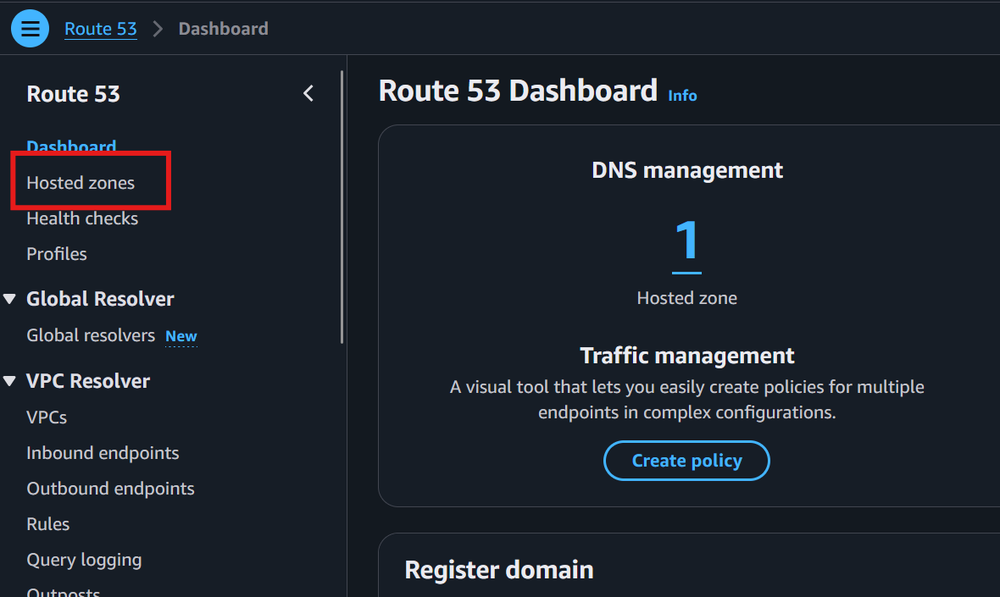
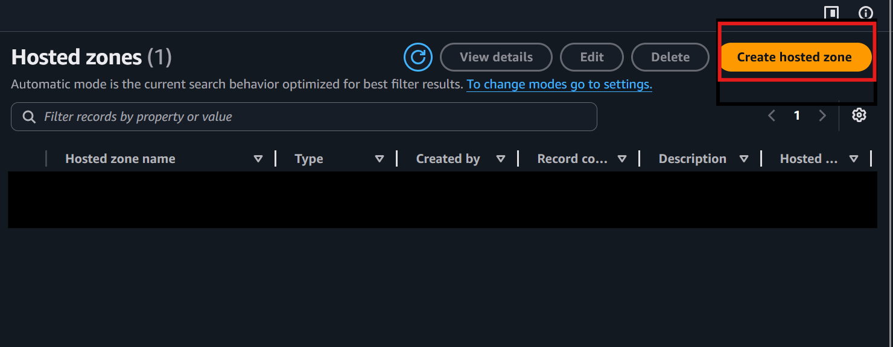
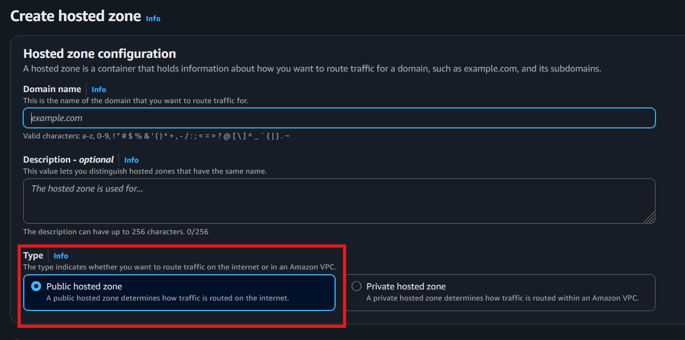
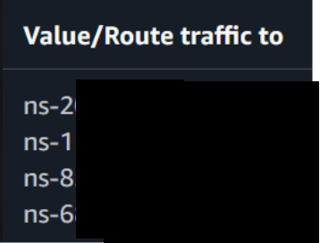

# Custom Domain & SES Email Setup

## Overview

GenRx uses Amazon SES for Cognito email delivery (verification codes, password resets). SES replaces Cognito's default email sender which is limited to 50 emails/day.

## Current state

If the project has been deployed as per the instructions laid out in the deployment guide, custom domain will NOT be setup by default, and email verification will be taking place via Cognito, which has an upper limit of 50 emails per day(therefore, 50 fresh sign ups in a day). Porting over to using SES will allow that limit to be raised to 50,000 emails per day. 

## Domain setup

Before the setup of SES, a domain is needed. This section will outline how exactly to go about configuring your own custom domain name. This domain will be the email address from which verification emails get sent from and also the final link through which users can access the web application. 

### Register a Domain (if you don't have one)

If your organization doesn't already own a domain, you need to register one first. You can do this directly through Route 53:

1. Go to **Route 53** → **Registered domains** → **Register domains**

2. Search for a domain name (e.g., `genrx-clinic.com`, `mypharmacylab.ca`)
3. Choose a TLD — `.com`, `.ca`, `.io`, etc. (pricing ranges $3–$15/year)
4. Fill in registrant contact info and complete the purchase
5. AWS automatically creates a hosted zone and configures nameservers for you

Once registered, your domain is ready to use — skip directly to the [Create a Route 53 Hosted Zone](#create-a-route-53-hosted-zone) section below (the hosted zone already exists if you registered via Route 53).

> **Timeline:** Domain registration is usually instant but can take up to 3 days for some TLDs. `.com` and `.ca` are typically immediate.

### Use a subdomain of an existing domain

If your organization already owns a domain (e.g., `example-domain.com`) and you want to use a subdomain (e.g., `app.example-domain.com`), follow the steps below to create a hosted zone and delegate it.

### Create a Route 53 Hosted Zone

1. Open Route 53 on AWS Console

2. Choose Hosted Zones in the left side panel.

3. Click on "Create Hosted Zone"

4. Enter your FULL subdomain name.  For type, choose public hosted zone.

5. Once created, a list of 4 Name Server (NS) records will be generated under the (NS) type. Note these values and send them to the account administrator for approval.


> **What happens next:** The domain administrator adds an NS record delegation in their DNS provider pointing your subdomain to these 4 Route 53 nameservers. Once that propagates (5 min – 48 hours), Route 53 has authority over your subdomain and CDK can create SES/Amplify records automatically.
>
> **What to tell your admin:** "Please add an NS record for `<your-subdomain>` pointing to these 4 nameservers: [paste the 4 values]. This delegates DNS authority for the subdomain to our AWS account."
>
> **How to verify it worked:** Run `nslookup -type=NS <your-subdomain>` in a terminal. If it returns the 4 Route 53 nameservers, delegation is complete and you can proceed with the CDK deploy.

## First-Time Setup (New Environment)

SES requires a two-step deployment because Cognito validates the SES identity is verified before accepting it.

### Step 1: Create the SES identity

Deploy **without** `SesIdentityVerified`:

```bash
cdk deploy --all \
  -c StackPrefix=<PREFIX> \
  -c githubRepo=<REPO> \
  -c githubBranch=main \
  -c SesVerifiedDomain=<YOUR-DOMAIN> \
  -c SesIdentityVerified="" \
  --profile <PROFILE>
```

This creates the SES domain identity and DKIM DNS records in Route 53 but keeps Cognito on default email.

### Step 2: Wait for verification

Go to **SES Console** → **Verified identities** → your domain. Wait until:
- Identity status: **Verified**
- DKIM: **Successful**

Usually takes 5-15 minutes.

### Step 3: Wire Cognito to SES

Deploy again (uses defaults from `cdk.json`):

```bash
cdk deploy --all \
  -c StackPrefix=<PREFIX> \
  -c githubRepo=<REPO> \
  -c githubBranch=main \
  -c SesVerifiedDomain=<YOUR-DOMAIN> \
  -c SesIdentityVerified=true \
  --profile <PROFILE>
```

### Step 4: Request SES production access (one-time)

New AWS accounts start in the SES sandbox. Go to **SES Console** → **Account dashboard** → **Request production access**:
- Mail type: Transactional
- Website URL: your app URL
- Use case: "Verification codes and password resets for clinical education platform."

Approval is usually within 24 hours.

## Context Variables

| Variable | Description | Required |
|----------|-------------|----------|
| `SesVerifiedDomain` | Domain with a Route 53 hosted zone (e.g., `app.YOUR-DOMAIN.com`) | Yes (for SES) |
| `SesIdentityVerified` | Set to `"true"` after the SES identity is verified | Yes (for Cognito to use SES) |
| `SesSkipIdentityCreation` | Set to `"true"` **only** if the SES identity was created outside of this CDK stack (e.g., manually or by another stack). See warning below. | No |

All are passed as `-c` context flags at deploy time. They are not set in `cdk.json` to avoid conflicts with first-time deployments that don't have a verified domain yet.

> **⚠️ CRITICAL: Do NOT use `SesSkipIdentityCreation=true` if the SES identity was created by this CDK stack.**
>
> When you pass `SesSkipIdentityCreation=true`, CDK removes the `ses.EmailIdentity` resource from the CloudFormation template. CloudFormation interprets this as a resource deletion and **destroys the SES identity from your account**. This causes Cognito's SES email configuration to break, reverting sign-up emails back to the default Cognito sender (50/day limit).
>
> Only use this flag if the SES identity was created by a different stack or manually in the console — i.e., it was never part of this stack's CloudFormation template.

## Day-to-Day Deployment

After initial setup, include the SES flags on **every** deploy:

```bash
cdk deploy --all \
  -c StackPrefix=<PREFIX> \
  -c githubRepo=<REPO> \
  -c githubBranch=<BRANCH> \
  -c SesVerifiedDomain=<YOUR-DOMAIN> \
  -c SesIdentityVerified=true \
  --profile <PROFILE>
```

> **⚠️ You MUST pass `SesVerifiedDomain` and `SesIdentityVerified=true` on every deploy.** If you omit these flags, CDK will:
> 1. Remove the SES identity resource → CloudFormation deletes it from your account
> 2. Switch Cognito back to its built-in email sender (50 emails/day limit)
>
> There is no way to "lock in" SES — the flags must be present every time.

> **Do NOT pass `SesSkipIdentityCreation=true`** on day-to-day deploys. The SES identity resource must stay in the CloudFormation template so CloudFormation does not delete it.

## What Gets Created

| Resource | Purpose |
|----------|---------|
| `ses.EmailIdentity` | Domain identity with DKIM (auto-verified via Route 53) |
| Route 53 DKIM records | 3 CNAME records for email authentication |
| Route 53 MAIL FROM record | MX + TXT records for bounce handling |
| Cognito `email` property | `UserPoolEmail.withSES()` with `noreply@<domain>` |

## How It Works

- Cognito sends all emails (verification codes, password resets) through SES
- Emails come from `noreply@YOUR-DOMAIN.com`
- DKIM ensures emails aren't flagged as spam
- No Lambda functions call SES directly — all email is Cognito-managed

## CORS

The custom domain (`YOUR-DOMAIN.com` and `www.YOUR-DOMAIN.com`) is automatically added to the API Gateway and Lambda CORS allowed origins when `SesVerifiedDomain` is set.

## Troubleshooting

### "Email address is not verified" during deploy

The SES identity isn't verified yet. Either:
- Wait longer (DKIM propagation can take up to 72 hours in rare cases)
- Deploy without `SesIdentityVerified` flag: `-c SesIdentityVerified=""`

### No identities in SES console

The deploy rolled back before creating the identity. Deploy without `SesIdentityVerified` first.

### Emails not arriving (sandbox mode)

You're still in SES sandbox — emails only go to verified addresses. Request production access from SES console.

## Amplify Custom Domain

The `SesVerifiedDomain` context variable also configures a custom domain for the Amplify frontend. When set, users can access the app at `https://YOUR-DOMAIN.com` instead of the default `*.amplifyapp.com` URL.

### Prerequisites

- A **public Route 53 hosted zone** for the domain (same one used by SES)
- The domain must be registered and its nameservers must point to Route 53

### What CDK Creates

- An `amplify.CfnDomain` resource mapping the root domain and `www` to the `main` branch
- Amplify auto-provisions an SSL certificate (ACM)
- Amplify creates the required CNAME/ALIAS DNS records in Route 53

### After Deployment

1. Go to **Amplify Console** → your app → **Domain management**
2. You'll see the domain progressing through: **Creating** → **Requesting certificate** → **Available**
3. SSL provisioning takes 10-30 minutes
4. Once status is **Available**, `https://YOUR-DOMAIN.com` serves your app

### Subdomain Mapping

| Domain | Branch | Description |
|--------|--------|-------------|
| `YOUR-DOMAIN.com` | main | Root domain → main branch |
| `www.YOUR-DOMAIN.com` | main | www redirect → root |

### Changing the Domain

To use a different domain:
1. Update `SesVerifiedDomain` in `cdk.json`
2. Ensure a Route 53 hosted zone exists for the new domain
3. Deploy — CDK will create a new SES identity + Amplify custom domain

### Custom Domain Does NOT Affect SES

These features share the same context variable for convenience but are independent:
- **SES** sends email from `noreply@<domain>`
- **Amplify** serves the frontend at `https://<domain>`

Changing or removing the custom domain does not break email delivery, and vice versa.

---

## Files

| File | SES-related content |
|------|-------------------|
| `cdk/bin/cdk.ts` | Reads `SesVerifiedDomain` context, passes to Api stack |
| `cdk/lib/api-service-stack.ts` | Creates SES identity, configures Cognito email |
| `cdk/lib/amplify-stack.ts` | Uses `SesVerifiedDomain` for Amplify custom domain |

---

## Glossary

- **Domain**: A human-readable address like `genrx-clinic.com` or `app.example-domain.com`. You either buy one or use a subdomain of one your organization already owns.
- **Hosted Zone**: A Route 53 container that holds DNS records for your domain. Think of it as the phone book entry that tells the internet where your domain's services live.
- **NS (Name Server) Records**: These tell the internet which DNS servers are authoritative for your domain. When you create a hosted zone, Route 53 gives you 4 NS records.
- **Delegation**: If using a subdomain of an existing domain, the parent domain's DNS must add NS records pointing the subdomain to Route 53. This is how Route 53 gets "permission" to manage the subdomain.
- **DKIM**: DomainKeys Identified Mail — a cryptographic signature added to emails so recipients can verify the email actually came from your domain and wasn't spoofed.
- **SES (Simple Email Service)**: AWS's email sending service. Cognito uses it to send verification codes and password reset emails from your domain instead of a generic AWS address.
- **SES Sandbox**: The default state for new SES accounts — you can only send emails to verified addresses. Production access removes this restriction.

---

## References

- [Cognito User Pool Email Settings (AWS Docs)](https://docs.aws.amazon.com/cognito/latest/developerguide/user-pool-email.html)
